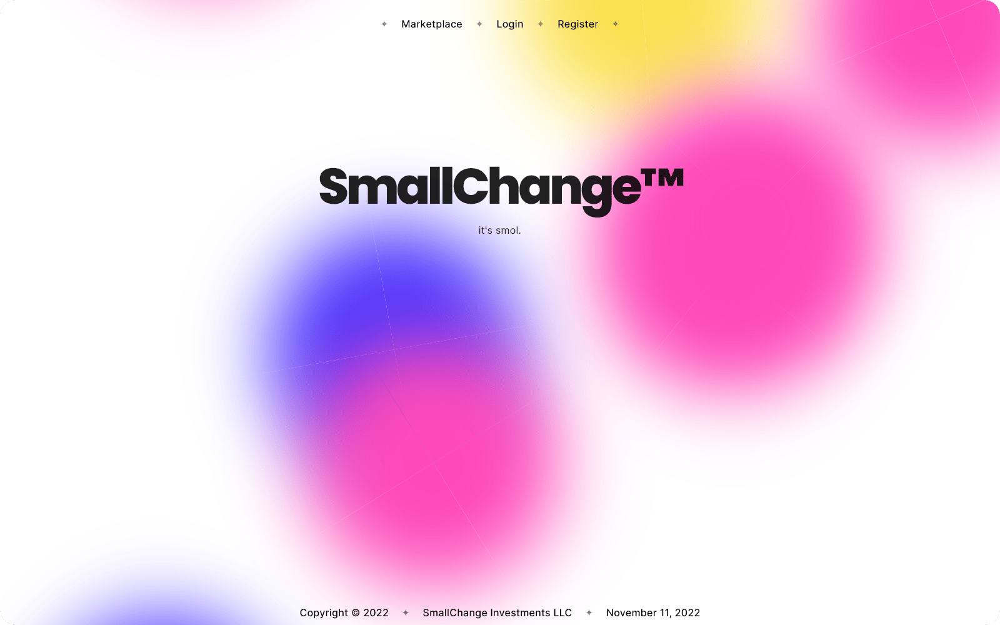
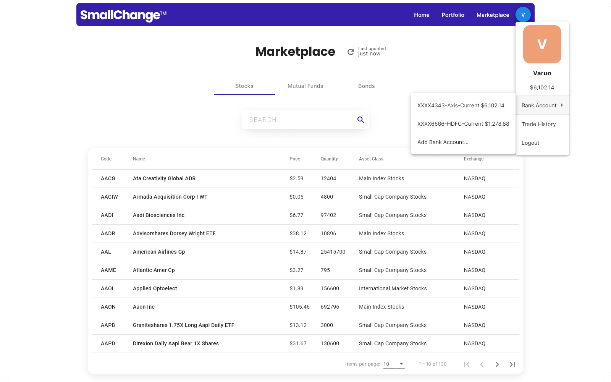
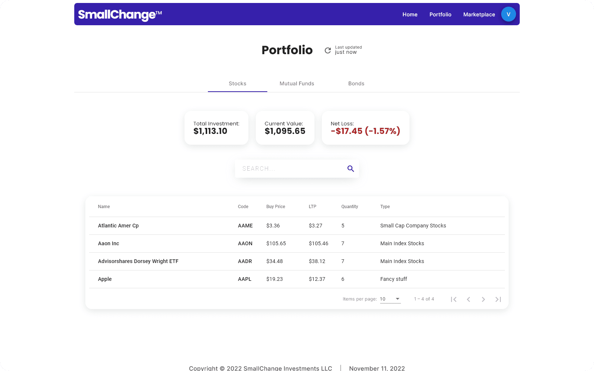
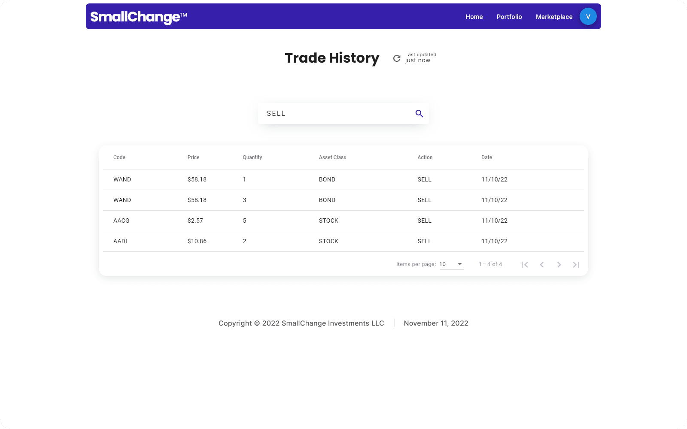
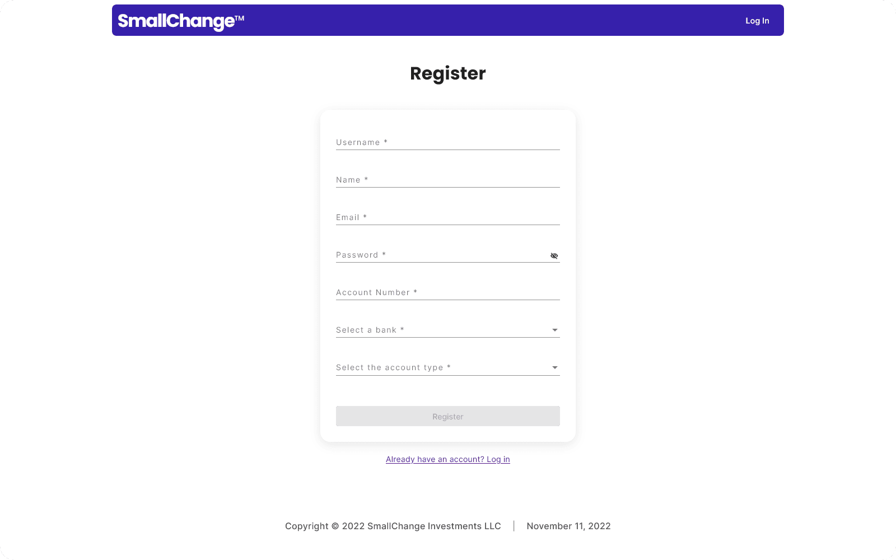
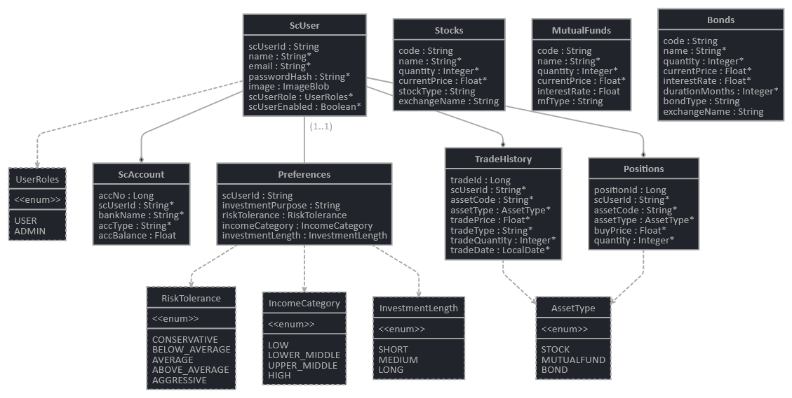

    
     
    <strong> Trading application built using Angular + SpringBoot.</strong>
     

## Features

- Frontend - Angular, Angular Material
- Backend - SpringBoot, Oracle DB
- JWT Authentication
- Automatic index price fluctuations
- REST API
- Secured admin API routes
- Jhipster monitoring, logging, Docker deployment support
- Swagger API Documentation

## Screenshots

    
     
    
     
    
     
    
     
    
     
    
     
    

